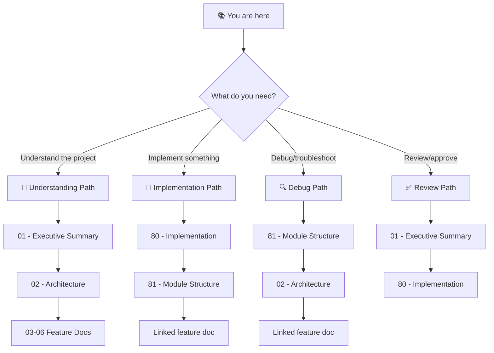

# 🏭 Warehouse Inventory System Frontend: Project Blueprint

> *A React/TypeScript SPA that makes warehouse stock management feel as natural as checking your phone.*

**Document Type:** Technical Design Document / Project Blueprint  
**Version:** 1.0  
**Created:** 2026-03-09  
**Status:** 🚧 In Progress

---

## 📊 Progress Overview

| Phase | Status | Notes |
|-------|--------|-------|
| P0: Walking Skeleton — API Integration | ✅ | `lib/api.ts` created; all 4 components migrated from localStorage |
| P1: Feature Completeness | 🔄 | Dashboard ✅, ViewInventory ✅, Transfer ✅, Import ✅ |
| P2: UX & Reliability Polish | ⏳ | Error boundaries, optimistic UI, form validation |
| P3: Production Readiness | ⏳ | Env config, e2e smoke, accessibility baseline |

### Status Legend

| Icon | Meaning |
|------|---------|
| ⏳ | TODO |
| 🔄 | WIP |
| ✅ | DONE |
| 🚧 | BLOCKED |
| 🚫 | CUT |

---

## 📐 Planning Standards

This blueprint follows **HyperDream phasing rules**:

| Principle | Meaning |
|-----------|---------|
| **Walking Skeleton First** | Phase 0 proves plumbing works with hardcoded stubs |
| **Difficulty Honesty** | Each item labeled `[KNOWN]`, `[EXPERIMENTAL]`, or `[RESEARCH]` |
| **Research ≠ Foundation** | `[RESEARCH]` items never in Phase 0 |
| **Incremental Value** | Each phase delivers usable functionality |

---

## 📑 Document Index

| # | Document | Required | Purpose (When to Read) |
|---|----------|----------|------------------------|
| 00 | [Index](./00_index.md) | ✓ | **Navigation hub** — Start here if lost |
| 01 | [Executive Summary](./01_executive_summary.md) | ✓ | **Vision & scope** — Read to understand what/why |
| 02 | [Architecture](./02_architecture.md) | ✓ | **System design** — Read to understand how pieces fit |
| 03 | [Feature: Dashboard](./03_feature_dashboard.md) | | **Feature detail** — Stats overview, KPI cards |
| 04 | [Feature: Import Data](./04_feature_import.md) | | **Feature detail** — CSV upload pipeline |
| 05 | [Feature: View Inventory](./05_feature_inventory.md) | | **Feature detail** — Search & browse stock levels |
| 06 | [Feature: Transfer Inventory](./06_feature_transfer.md) | | **Feature detail** — Move stock between locations |
| 80 | [Implementation](./80_implementation.md) | ✓ | **Task tracking** — Read to start/track work |
| 81 | [Module Structure](./81_module_structure.md) | ✓ | **Code organization** — Read to find where code lives |
| 99 | [References](./99_references.md) | | **Links** — External docs, API contracts, libraries |

---

## 💭 Vision Statement

> *"A warehouse manager should never have to open a spreadsheet to answer 'how much stock do we have at location X?' — the WIS Frontend makes that question answerable in two clicks from any browser."*

---

## 🧭 How to Navigate This Blueprint

### Reading Order Decision Tree

### Document Purpose Quick Reference

| Doc | When to Read | One-Line Purpose |
|-----|--------------|------------------|
| **00 - Index** | First visit, when lost | Navigation hub, progress overview |
| **01 - Exec Summary** | Deciding scope / onboarding | Goals, non-goals, prior art |
| **02 - Architecture** | Understanding system design | Component map, data flow, API boundaries |
| **03-06 - Features** | Implementing a specific page | User stories, acceptance criteria, edge cases |
| **80 - Implementation** | Starting work, tracking tasks | Phased tasks with difficulty labels |
| **81 - Module Structure** | Finding where code lives | Lib vs component vs style boundaries |
| **99 - References** | Linking to external docs | API specs, library docs, backend repo |
