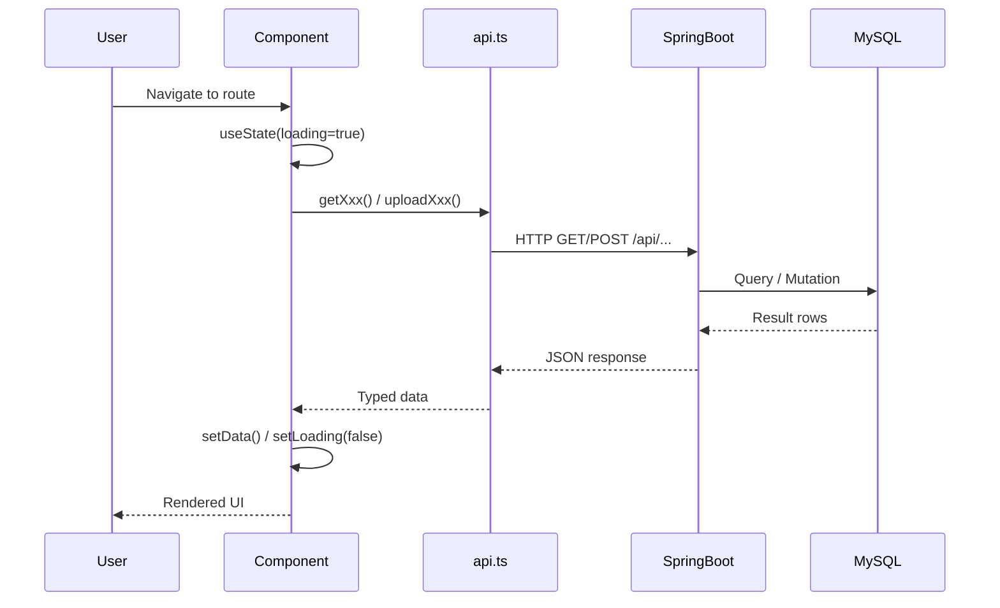

# 02 - Architecture

> Part of [WIS Frontend Blueprint](./00_index.md)

---

## 📖 The Story

### 😤 The Pain

```
Before Architecture Lock-In:
┌──────────────────────────────────────────────────┐
│  Component wants data                            │
│       ↓                                          │
│  💥 Calls localStorage directly (storage.ts)     │
│       ↓                                          │
│  💥 No separation between UI and data layer      │
│  💥 Testing impossible without mocking Browser   │
│  💥 Backend integration requires rewriting       │
└──────────────────────────────────────────────────┘
```

| Who Hurts | Pain Level | Frequency |
|-----------|------------|-----------|
| Developer extending a component | 🔥🔥🔥 High | Every PR |
| QA trying to write tests | 🔥🔥🔥 High | Always |

### ✨ The Vision

```
After Clean Architecture:
┌──────────────────────────────────────────────────┐
│  Component wants data                            │
│       ↓                                          │
│  ✅ Calls lib/api.ts typed function              │
│       ↓                                          │
│  ✅ Axios → Spring Boot REST API → MySQL         │
│       ↓                                          │
│  ✅ Typed response, loading/error states handled │
└──────────────────────────────────────────────────┘
```

### 🎯 One-Liner

> A clean three-layer architecture: UI components → typed API client → Spring Boot REST backend.

---

## 🔧 The Spec

---

## 🏗️ System Overview

### High-Level Architecture

```mermaid
flowchart TB
    subgraph "Browser (React SPA @ Vite)"
        subgraph "Route Layer"
            R1[/ → Dashboard]
            R2[/import → ImportData]
            R3[/inventory → ViewInventory]
            R4[/transfer → TransferInventory]
            R5[/docs → Documentation]
        end

        subgraph "Component Layer"
            L[Layout.tsx — Nav + Outlet]
        end

        subgraph "Data Layer"
            API[lib/api.ts — Axios client]
            CSV[lib/csv.ts — CSV helpers]
            TYPES[types.ts — Shared interfaces]
        end

        subgraph "UI Layer"
            UI[components/ui/ — shadcn/ui]
            STYLES[styles/ — Tailwind CSS 4.x]
        end
    end

    subgraph "Spring Boot Backend @ :8080"
        EP_DASH[GET /api/dashboard]
        EP_INV[GET /api/inventory]
        EP_SRCH[GET /api/inventory/search]
        EP_LOC[GET /api/inventory/locations]
        EP_PROD[GET /api/products]
        EP_TR[POST /api/transfers]
        EP_IMP_P[POST /api/import/products]
        EP_IMP_I[POST /api/import/inventory]
    end

    subgraph "MySQL 8.x Database"
        DB[(Products + Inventory Tables)]
    end

    R1 --> API
    R2 --> API
    R2 --> CSV
    R3 --> API
    R4 --> API

    API --> EP_DASH
    API --> EP_INV
    API --> EP_SRCH
    API --> EP_LOC
    API --> EP_PROD
    API --> EP_TR
    API --> EP_IMP_P
    API --> EP_IMP_I

    EP_DASH --> DB
    EP_INV --> DB
    EP_PROD --> DB
    EP_TR --> DB
```

---

## 📊 Data Flow

### Per-Route API Sequence



### Stage Details

| Stage | Input | Transformation | Output | Owner |
|-------|-------|----------------|--------|-------|
| Route Mount | URL change | React Router renders component | Component tree | `routes.ts` |
| Data Fetch | `useEffect` trigger | Axios GET/POST | Promise<TypedData> | `lib/api.ts` |
| Transform | Raw `FlatInventoryItem[]` | Group by productCode | `InventoryLevel[]` | `lib/api.ts` |
| Render | Typed state | Conditional UI (loading/error/data) | React elements | Component |
| CSV Upload | `File` object | `FormData` multipart | `ImportResult` | `lib/api.ts` |

---

## 🗂️ Logical Component Map

```
src/app/
├── App.tsx                    → RouterProvider wrapper
├── routes.ts                  → createBrowserRouter config
├── types.ts                   → Shared TypeScript interfaces
│
├── components/
│   ├── Layout.tsx             → Top-nav + <Outlet /> shell
│   ├── Dashboard.tsx          → /           → getDashboardData()
│   ├── ImportData.tsx         → /import     → uploadProductsCsv(), uploadInventoryCsv()
│   ├── ViewInventory.tsx      → /inventory  → getInventoryLevels(), searchInventory()
│   ├── TransferInventory.tsx  → /transfer   → getProducts(), getLocations(), transferInventory()
│   └── Documentation.tsx      → /docs       → static content
│
└── lib/
    ├── api.ts                 → Single Axios instance + all typed API functions
    └── csv.ts                 → CSV download helper (downloadCSV)
```

---

## 🔗 API Contract Reference

| Function in api.ts | Method | Endpoint | Response Type |
|--------------------|--------|----------|---------------|
| `getDashboardData` | GET | `/dashboard` | `DashboardData` |
| `getInventoryLevels` | GET | `/inventory` + `/products` | `InventoryLevel[]` |
| `searchInventory(code)` | GET | `/inventory/search?code=` + `/products` | `InventoryLevel[]` |
| `getLocations` | GET | `/inventory/locations` | `string[]` |
| `getProducts` | GET | `/products` | `Product[]` |
| `transferInventory(req)` | POST | `/transfers` | `{status, message}` |
| `uploadProductsCsv(file)` | POST | `/import/products` | `ImportResult` |
| `uploadInventoryCsv(file)` | POST | `/import/inventory` | `ImportResult` |

---

## ⚠️ Architecture Decisions & Constraints

| Decision | Rationale |
|----------|-----------|
| Single Axios instance in `api.ts` | Prevents base URL drift; one place for future interceptors |
| `FlatInventoryItem[]` → `InventoryLevel[]` transform in `api.ts` | Backend returns flat rows; UI needs grouped-by-product view |
| No React Query / SWR in P0/P1 | Adds dependency for marginal gain at current scale |
| `VITE_API_BASE_URL` env var with localhost fallback | Dev works without `.env` file; prod overridable |
| `getApiErrorMessage()` helper | Centralizes Axios error unwrapping; components stay clean |

---

**Prev:** [01 - Executive Summary](./01_executive_summary.md)  
**Next:** [03 - Feature: Dashboard](./03_feature_dashboard.md)  
**← Back to:** [Index](./00_index.md)
