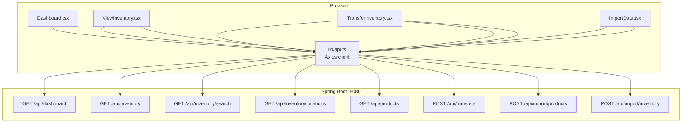

# API Migration Plan: localStorage → Spring Boot REST API

> **Document Owner**: WarehouseDream  
> **Status**: Ready for WarehouseArch implementation  
> **Date**: March 9, 2026

---

## Summary

The current frontend stores all data in browser `localStorage` via `storage.ts`. The Spring Boot backend at `http://localhost:8080/api` is ready and exposes all needed endpoints. This plan details the exact steps to wire the frontend to the real API.

**Gap**: `src/app/lib/api.ts` does not exist yet. It must be created first, then all 4 components migrated.

---

## Current State Diagnostic

| File | localStorage calls | Needs migration? |
|------|--------------------|-----------------|
| `src/app/lib/storage.ts` | All data ops | Retire after migration |
| `src/app/types.ts` | — | Add `DashboardData`, `ImportResult` |
| `Dashboard.tsx` | `getProducts()`, `getInventory()` (computes stats client-side) | ✅ Yes |
| `ViewInventory.tsx` | `getProducts()`, `getInventory()` (filters client-side) | ✅ Yes |
| `TransferInventory.tsx` | `getProducts()`, `getInventory()`, `transferInventory()` | ✅ Yes |
| `ImportData.tsx` | `addProducts()`, `addInventory()`, `getProducts()`, `getInventory()` | ✅ Yes |

---

## Data Flow Architecture



---

## Phase P0 — Foundation [KNOWN]

### Step 1 — Extend `src/app/types.ts`

Add two missing types that `api.ts` needs to export:

```typescript
// Append to src/app/types.ts

export interface DashboardData {
  totalProducts: number;
  totalLocations: number;
  totalUnits: number;
  topLocations: { location: string; quantity: number }[];
}

export interface ImportResult {
  success: boolean;
  importedCount: number;
  skippedCount: number;
  errors: string[];
}
```

> **Why not in api.ts?** `DashboardData` and `ImportResult` are domain types; co-locating all types in `types.ts` keeps imports consistent.

---

### Step 2 — Create `src/app/lib/api.ts`

Full content of the new file, derived from the reference code in `Documentation.tsx`:

```typescript
import axios from 'axios';
import type {
  Product,
  InventoryLevel,
  TransferRequest,
  DashboardData,
  ImportResult,
} from '../types';

// Reads VITE_API_BASE_URL from .env; falls back to local Spring Boot
const api = axios.create({
  baseURL: import.meta.env.VITE_API_BASE_URL ?? 'http://localhost:8080/api',
  headers: { 'Content-Type': 'application/json' },
});

// ─── Products ────────────────────────────────────────────────

export async function getProducts(): Promise<Product[]> {
  const { data } = await api.get<Product[]>('/products');
  return data;
}

// ─── Inventory ───────────────────────────────────────────────

export async function getInventoryLevels(): Promise<InventoryLevel[]> {
  const { data } = await api.get<InventoryLevel[]>('/inventory');
  return data;
}

export async function searchInventory(code: string): Promise<InventoryLevel[]> {
  const { data } = await api.get<InventoryLevel[]>('/inventory/search', {
    params: { code },
  });
  return data;
}

export async function getLocations(): Promise<string[]> {
  const { data } = await api.get<string[]>('/inventory/locations');
  return data;
}

// ─── Transfers ───────────────────────────────────────────────

export async function transferInventory(
  request: TransferRequest
): Promise<{ status: string; message: string }> {
  const { data } = await api.post<{ status: string; message: string }>(
    '/transfers',
    request
  );
  return data;
}

// ─── Import (multipart CSV) ──────────────────────────────────

export async function uploadProductsCsv(file: File): Promise<ImportResult> {
  const form = new FormData();
  form.append('file', file);
  const { data } = await api.post<ImportResult>('/import/products', form, {
    headers: { 'Content-Type': 'multipart/form-data' },
  });
  return data;
}

export async function uploadInventoryCsv(file: File): Promise<ImportResult> {
  const form = new FormData();
  form.append('file', file);
  const { data } = await api.post<ImportResult>('/import/inventory', form, {
    headers: { 'Content-Type': 'multipart/form-data' },
  });
  return data;
}

// ─── Dashboard ───────────────────────────────────────────────

export async function getDashboardData(): Promise<DashboardData> {
  const { data } = await api.get<DashboardData>('/dashboard');
  return data;
}
```

> **Security note**: Axios does not automatically set CORS headers from the browser; that's handled server-side in Spring Boot. No credentials are transmitted, so no CSRF token manipulation is needed for this API.

---

## Phase P1 — Component Migration [KNOWN]

### Component Diff Table

| Component | Remove | Add | State changes |
|-----------|--------|-----|---------------|
| `Dashboard.tsx` | `storage`, `Product[]`, `InventoryItem[]`, client-side aggregation | `getDashboardData()`, `DashboardData` | Replace 2 states with 1 `DashboardData` state |
| `ViewInventory.tsx` | `storage`, `products`, `inventory`, client-side `filterInventory()` | `getInventoryLevels()`, `searchInventory()` | Remove `products` + `inventory` raw states; keep `filteredInventory` |
| `TransferInventory.tsx` | `storage`, `InventoryItem[]`, client-side locations/availability calc | `getProducts()`, `getLocations()`, `transferInventory()` | Replace `inventory` with `locations: string[]` |
| `ImportData.tsx` | `storage.addProducts()`, `storage.addInventory()`, `storage.getProducts()`, `storage.getInventory()` | `uploadProductsCsv()`, `uploadInventoryCsv()` | Remove export-current-data download (now API-sourced) OR wire downloads to a GET endpoint |

---

### 3.1 Dashboard.tsx Migration

**Before** (synchronous, client-side computation):
```typescript
const [products, setProducts] = useState<Product[]>([]);
const [inventory, setInventory] = useState<InventoryItem[]>([]);

const loadData = () => {
  setProducts(storage.getProducts());
  setInventory(storage.getInventory());
};

// ... then computes totalProducts, totalLocations, totalUnits, topLocations locally
```

**After** (async, server-computed):
```typescript
import { getDashboardData, type DashboardData } from '../lib/api';

const [data, setData] = useState<DashboardData | null>(null);
const [loading, setLoading] = useState(true);
const [error, setError] = useState<string | null>(null);

const loadData = async () => {
  try {
    setLoading(true);
    setData(await getDashboardData());
  } catch {
    setError('Failed to load dashboard data');
  } finally {
    setLoading(false);
  }
};

// Destructure: data.totalProducts, data.totalLocations, data.totalUnits, data.topLocations
```

---

### 3.2 ViewInventory.tsx Migration

**Key insight**: The backend's `GET /api/inventory/search?code=X` replaces ALL of the client-side `filterInventory()` logic. The `products` raw array and `inventory` raw array states disappear entirely.

**Before**:
```typescript
const [products, setProducts] = useState<Product[]>([]);
const [inventory, setInventory] = useState<InventoryItem[]>([]);
const [filteredInventory, setFilteredInventory] = useState<InventoryLevel[]>([]);

const loadData = () => {
  setProducts(storage.getProducts());
  setInventory(storage.getInventory());
};

// ... filterInventory() does client-side grouping/searching
```

**After**:
```typescript
import { getInventoryLevels, searchInventory } from '../lib/api';

const [inventory, setInventory] = useState<InventoryLevel[]>([]);
const [loading, setLoading] = useState(true);

const loadData = async () => {
  setLoading(true);
  setInventory(await getInventoryLevels());
  setLoading(false);
};

// On search input change:
const handleSearch = async (code: string) => {
  if (!code.trim()) {
    setInventory(await getInventoryLevels());
  } else {
    setInventory(await searchInventory(code));
  }
};
```

> The `useEffect` that calls `filterInventory()` on `[searchCode, products, inventory]` is replaced with a debounced `useEffect` on `[searchCode]` that calls the API.

---

### 3.3 TransferInventory.tsx Migration

**Key insight**: The `inventory: InventoryItem[]` state was used only to derive `availableLocations` and `getAvailableQuantity()`. The backend's `GET /api/inventory/locations` gives locations directly. `getAvailableQuantity()` can either call the API or be removed (backend validates quantity anyway).

**Before**:
```typescript
const [products, setProducts] = useState<Product[]>([]);
const [inventory, setInventory] = useState<InventoryItem[]>([]);

const loadData = () => {
  setProducts(storage.getProducts());
  setInventory(storage.getInventory());
};

const availableLocations = Array.from(new Set(inventory.map(i => i.location))).sort();
```

**After**:
```typescript
import { getProducts, getLocations, transferInventory } from '../lib/api';

const [products, setProducts] = useState<Product[]>([]);
const [locations, setLocations] = useState<string[]>([]);

const loadData = async () => {
  const [prods, locs] = await Promise.all([getProducts(), getLocations()]);
  setProducts(prods);
  setLocations(locs);
};

// handleTransfer becomes async:
const handleTransfer = async (e) => {
  e.preventDefault();
  try {
    const result = await transferInventory({ productCode, fromLocation, toLocation, quantity: +quantity });
    setStatus('success');
    setMessage(result.message);
  } catch (err) {
    setStatus('error');
    setMessage(err?.response?.data?.message ?? 'Transfer failed');
  }
};
```

---

### 3.4 ImportData.tsx Migration

**Before**: Parses CSV in-browser, writes to localStorage.  
**After**: Sends the raw `File` directly as multipart to the backend. No in-browser parsing needed for imports.

```typescript
import { uploadProductsCsv, uploadInventoryCsv } from '../lib/api';

const handleProductUpload = async (e) => {
  const file = e.target.files?.[0];
  if (!file) return;
  try {
    const result = await uploadProductsCsv(file);
    setProductStatus('success');
    setProductMessage(`Imported ${result.importedCount}, skipped ${result.skippedCount}`);
  } catch {
    setProductStatus('error');
    setProductMessage('Upload failed — check server connection');
  }
};
```

> The `parseProductsCSV` / `parseInventoryCSV` imports from `csv.ts` can be REMOVED from ImportData after migration (they're no longer needed for import; `csv.ts` can keep its export/download helpers).

---

## Phase P2 — Loading States & Error Handling [KNOWN]

### Pattern: Skeleton loading for list views

```tsx
if (loading) {
  return (
    <div className="space-y-3">
      {[...Array(3)].map((_, i) => (
        <div key={i} className="h-16 bg-gray-100 rounded animate-pulse" />
      ))}
    </div>
  );
}
```

> The existing `Skeleton` component is already available in `src/app/components/ui/skeleton.tsx`.

### Pattern: Inline error state

```tsx
if (error) {
  return (
    <div className="flex items-center gap-2 text-red-600 p-4 bg-red-50 rounded">
      <AlertCircle className="h-5 w-5" />
      <span>{error}</span>
      <button onClick={loadData}>Retry</button>
    </div>
  );
}
```

### Axios error extraction helper (add to `api.ts`)

```typescript
export function getApiErrorMessage(err: unknown): string {
  if (axios.isAxiosError(err)) {
    return err.response?.data?.message ?? err.message;
  }
  return 'An unexpected error occurred';
}
```

---

## Sequencing & Dependencies

```
types.ts (add DashboardData, ImportResult)
    ↓
api.ts (create — depends on updated types.ts)
    ↓
Dashboard.tsx    ViewInventory.tsx    TransferInventory.tsx    ImportData.tsx
(all independent of each other, can be done in parallel)
```

---

## Environment Setup Required

Create or verify `c:\Users\User\my-react-app\.env`:
```
VITE_API_BASE_URL=http://localhost:8080/api
```

---

## Feasibility Assessment

| Item | Label | Notes |
|------|-------|-------|
| `api.ts` Axios client | [KNOWN] | Axios already installed; reference code in Documentation.tsx |
| Type additions | [KNOWN] | Straightforward additions to types.ts |
| Dashboard migration | [KNOWN] | Simpler post-migration (removes client calc) |
| ViewInventory migration | [KNOWN] | Remove filter logic; delegate to search endpoint |
| TransferInventory migration | [KNOWN] | Async form submission; parallel data load |
| ImportData migration | [KNOWN] | Multipart upload; remove localStorage writes |
| Loading/error UI | [KNOWN] | Skeleton + Alert already in shadcn/ui |

---

## Open Questions

1. **Export downloads** (`ImportData.tsx` has "Download Current Products/Inventory"): After migration, these buttons call `storage.getProducts()` / `storage.getInventory()`. They should either call `GET /api/products` + `GET /api/inventory` or be removed. Decision needed.

2. **`getAvailableQuantity()` in TransferInventory**: Currently reads from in-memory `inventory`. Post-migration, either derive from a fresh API call or remove the UI preview (backend validates anyway).

3. **Debounce on search**: Should `ViewInventory` debounce the search API call? Recommend 300ms debounce to avoid excess requests on fast typing.

---

## Handoff to WarehouseArch

**WarehouseArch should implement in this order:**
1. Add `DashboardData` and `ImportResult` to `src/app/types.ts`
2. Create `src/app/lib/api.ts` (full content above)
3. Migrate `Dashboard.tsx`
4. Migrate `ViewInventory.tsx`
5. Migrate `TransferInventory.tsx`
6. Migrate `ImportData.tsx`
7. Verify `.env` has `VITE_API_BASE_URL`
