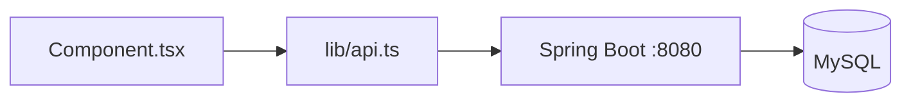
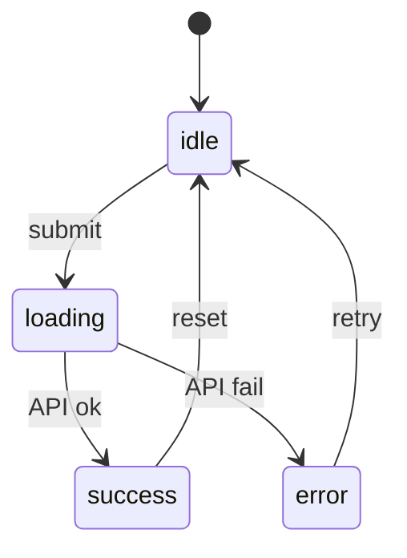

# WIS Frontend Blueprint Asset Authoring Guidelines

## Purpose
Asset files capture non-code planning artifacts: UI mockups, architecture diagrams, data flow storyboards, and design specs. They supplement feature docs with visual detail.

---

## Asset Types

| Type | Use For | Example Filename |
|------|---------|------------------|
| `mockup` | UI wireframes, screen layouts | `03_dashboard_mockup.asset.md` |
| `diagram` | Architecture, flow, component maps | `02_api_flow_diagram.asset.md` |
| `storyboard` | User journey sequences | `04_import_storyboard.asset.md` |
| `design` | Visual design specs, Tailwind token map | `05_theme_design.asset.md` |
| `data-model` | Type relationships, DTO schemas | `02_dto_data_model.asset.md` |
| `other` | Anything not above | `06_research_notes.asset.md` |

---

## Naming Convention

```
{feature_id}_{description}.asset.md
```

- **feature_id**: Two-digit number matching the related feature document (e.g., `05` for `05_feature_inventory.md`)
- **description**: Lowercase, underscore-separated
- **Examples**: `05_inventory_search_mockup.asset.md`, `02_api_sequence_diagram.asset.md`

---

## Required Sections

```markdown
# {Asset Title}

**Type:** {mockup|diagram|storyboard|design|data-model|other}
**Related Feature:** [Feature Title](../blueprint/NN_feature_name.md)
**Status:** `⏳ [TODO]` | `🔄 [WIP]` | `✅ [DONE]` | `🚧 [BLOCKED:reason]`

## Context
Why this asset exists and what question it answers.

## The Artifact
The actual content: Mermaid diagram, ASCII mockup, or embedded image reference.

## Constraints
Limitations, assumptions, or fixed requirements this asset respects.

## Related Features
Links to other features or assets this depends on or affects.
```

---

## Content Guidelines

### Diagrams
- Use **Mermaid** for all flowcharts, sequences, ER diagrams
- Maximum complexity: fits on one screen without scrolling
- For complex systems, split into multiple focused diagrams

### Mockups
- ASCII art for quick layout sketches
- Reference Figma/Excalidraw with links for detailed mockups
- Include key Tailwind class notes inline (e.g., `className="grid-cols-3"`)

### WIS-Specific Diagram Patterns

**Component-to-API flow:**


**State machine for form status:**


---

## Linking Convention

### From Feature Doc to Asset
```markdown
## 🖼️ Related Assets
- [Dashboard Mockup](../assets/03_dashboard_mockup.asset.md)
```

### From Asset to Feature
```markdown
**Related Feature:** [Dashboard](../03_feature_dashboard.md)
```

---

## Line Limits

| Section | Limit |
|---------|-------|
| Context | ~20 lines |
| Constraints | ~10 lines |
| Related Features | ~10 lines |
| **Total (excluding diagrams)** | **≤100 lines** |

Mermaid diagrams and embedded images do NOT count toward line limit.

---

## Anti-Patterns

| ❌ Don't | ✅ Do Instead |
|----------|---------------|
| Embed React/TypeScript code | Assets are for visuals/planning, not implementation |
| Create orphan assets | Always link to parent feature doc |
| Exceed 100 lines | Split into focused sub-assets |
| Skip the Context section | Always explain WHY this asset exists |
