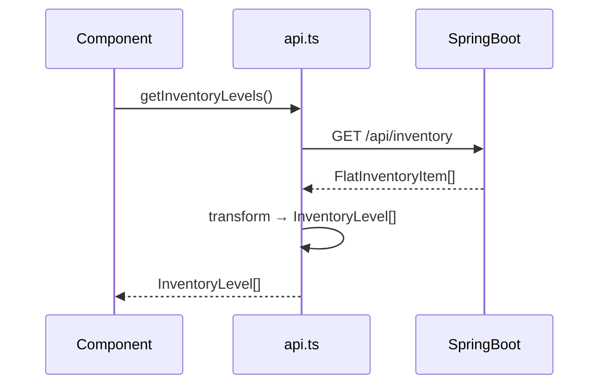

# WIS Frontend Blueprint Authoring Guidelines

## Goals
- Standardize vision, feature, architecture, and implementation documents for the Warehouse Inventory System frontend.
- Keep planning documents focused, visually scannable, and actionable.
- Ensure consistency across all WarehouseDream-generated artifacts.

---

## Tier Selection

| Tier | Use When | Template |
|------|----------|----------|
| **Simple** | ≤2 features, single module, no new API endpoints | `simple.template.md` |
| **Blueprint** | ≥3 features OR ≥2 cross-module deps OR new API calls | `blueprint/` folder set |

**WIS Frontend is Blueprint tier** — all new planning documents MUST use the blueprint set.

### Template Location
All templates: `my-react-app/data/.agent_plan/day_dream/templates/`

---

## Active Blueprint Location

```
.agent_plan/day_dream/wis_frontend/
├── 00_index.md           ← Navigation hub (start here)
├── 01_executive_summary.md
├── 02_architecture.md
├── 03_feature_dashboard.md    ← ✅ DONE
├── 04_feature_import.md       ← ✅ DONE
├── 05_feature_inventory.md    ← ✅ DONE
├── 06_feature_transfer.md     ← ✅ DONE
├── 80_implementation.md       ← Phase tracker (update when completing tasks)
├── 81_module_structure.md
└── 99_references.md
```

**New feature documents**: numbered sequentially from `07_` onwards.

---

## Required Blueprint Documents (Minimum Set)

| Doc | Required | Notes |
|-----|----------|-------|
| `00_index.md` | ✓ | Always first; update when features are added |
| `01_executive_summary.md` | ✓ | Update success metrics when phases complete |
| `02_architecture.md` | ✓ | Update API contract table if new endpoints added |
| `NN_feature_*.md` | Per feature | Create before implementing each feature |
| `80_implementation.md` | ✓ | Update task statuses as work progresses |
| `81_module_structure.md` | ✓ | Update file tree when new files are added |
| `99_references.md` | Optional | Add links as discovered |

---

## Document Structure: Story → Spec Pattern

Every document follows this pattern:

```markdown
## 📖 The Story
{Visual narrative: Before/After table or ASCII diagram}

### 🎯 One-Liner
> {Elevator pitch in ONE sentence}

---

## 🔧 The Spec
{Technical specification detail below this line}
```

The Story section MUST be visual and scannable. No walls of text. A warehouse manager should understand in 10 seconds.

---

## Status Markers

Use ONLY these hybrid emoji + text markers:

| Emoji | Text | Meaning |
|-------|------|---------|
| ⏳ | `[TODO]` | Not started |
| 🔄 | `[WIP]` | In progress |
| ✅ | `[DONE]` | Complete |
| 🚧 | `[BLOCKED:reason]` | Stuck (kebab-case reason) |
| 🚫 | `[CUT]` | Removed from scope |

**Example:** `⏳ [TODO]`, `🔄 [WIP]`, `✅ [DONE]`

---

## Difficulty Labels

Every feature and task line MUST have a difficulty label:

| Label | Meaning | P0 Allowed? |
|-------|---------|-------------|
| `[KNOWN]` | Standard patterns, proven libraries | ✅ Yes |
| `[EXPERIMENTAL]` | Needs validation in React/Tailwind context | ⚠️ Conditional |
| `[RESEARCH]` | Active problem, no proven solution | ❌ NEVER in P0 |

---

## Phase Rules

| Phase | Purpose | Constraint |
|-------|---------|------------|
| **P0** | Walking Skeleton — proves plumbing works | ≤5 tasks, `[KNOWN]` only, ≤2 weeks |
| **P1** | Feature completeness — everything usable | `[EXPERIMENTAL]` allowed with validation plan |
| **P2+** | Polish, performance, nice-to-haves | `[RESEARCH]` allowed when P0/P1 are complete |

**P0 Hard Rule**: Every P0 must have a one-command exit gate proving it works.

---

## Mermaid Diagrams

Required in architecture and feature docs:
- `flowchart TD` for component/data flow
- `sequenceDiagram` for API request/response sequences
- Keep diagrams focused — one concern per diagram

Example for WIS data flow:


---

## Before/After Visual (Required in Feature Docs)

```markdown
### 😤 The Pain → ✨ The Vision

\`\`\`
┌──────────────────────────────────┬──────────────────────────────────┐
│  BEFORE                          │  AFTER                           │
├──────────────────────────────────┼──────────────────────────────────┤
│  User wants {X}                  │  User wants {X}                  │
│       ↓                          │       ↓                          │
│  💥 {blocker}                    │  ✅ {solution}                   │
└──────────────────────────────────┴──────────────────────────────────┘
\`\`\`
```

---

## Updating `80_implementation.md` After Work Completes

When a task is done, update the task table row:

```markdown
| ✅ | Task description | `module/` | `[KNOWN]` |
```

And update the Phase frontmatter:
```yaml
current_phase: 1
status: WIP
last_updated: "YYYY-MM-DD"
```
